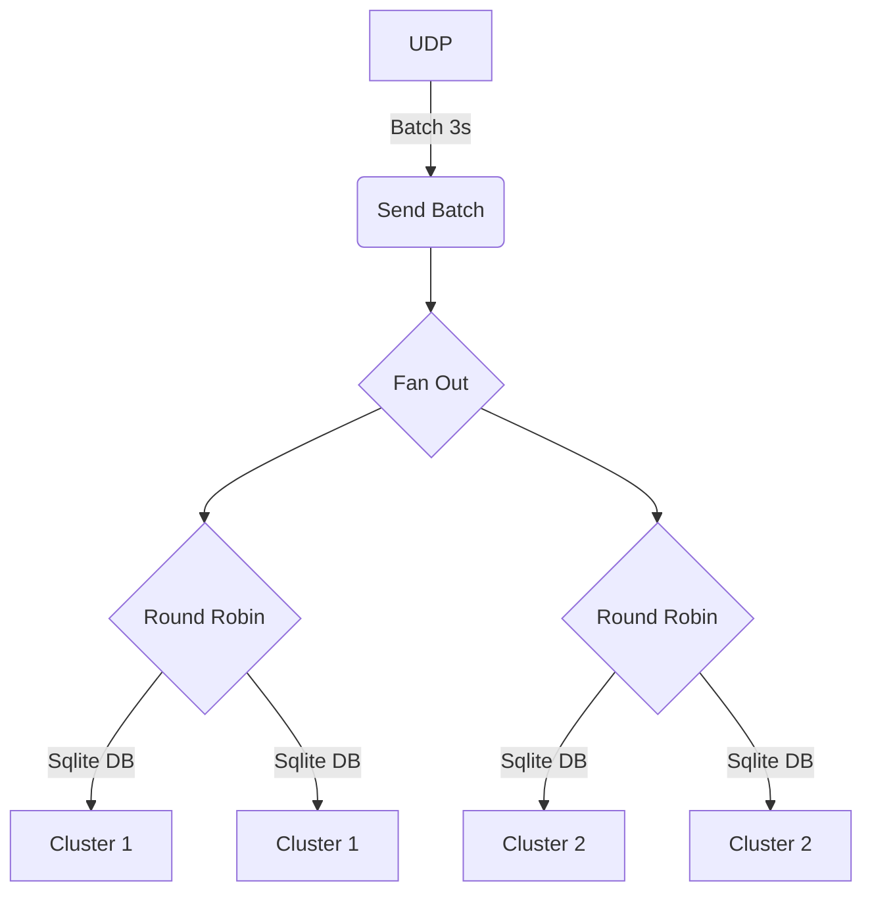

# Connect Pipeline

Store and forward standard processing using Redpanda Connect

1. Capture UDP 514 syslog packets in a buffer
2. Emit batches from buffer to both active backends
3. One each producer,
   1. round robin between N producers
   2. use a SQLlite db to store batches
   3. transmit to Redpanda services
   4. Remove from database once batch succeeds

